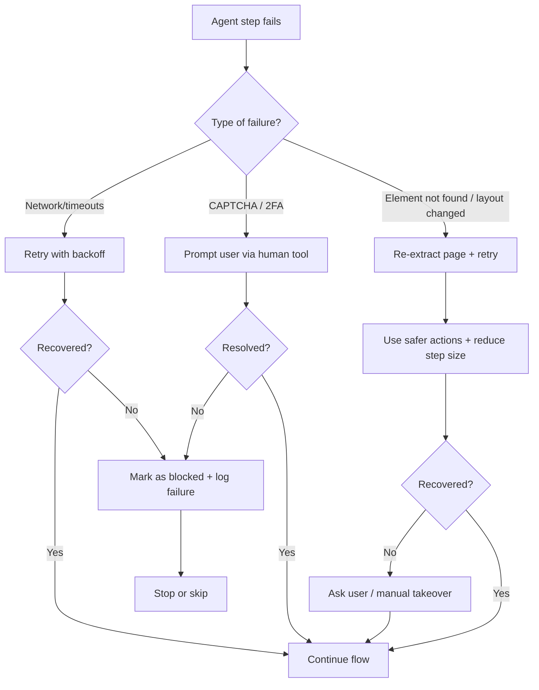

# Workflow Diagram — Job Application Automation System

> Date: 2026-01-15  
> This document describes the **end-to-end flow** of the app, including **Autonomous** and **Single Job URL** modes, **duplicate prevention via Application Tracker**, **resume tailoring + cover letter generation**, **Browser Use automation**, and **human-in-the-loop checkpoints**.

---

## 1) High-level flow (mode → dedupe → apply)

```mermaid
flowchart TD
  A([Start]) --> B{Mode selector}
  B -->|Autonomous| C[Autonomous controller]
  B -->|Single Job URL| D[User inputs job URL]

  C --> C1[Collect job leads]
  C1 --> C2[Normalize + dedupe leads]
  C2 --> C3[Rank / prioritize queue]
  C3 --> E{Next job in queue?}
  E -->|No| C4[Sleep until next run] --> C1
  E -->|Yes| F[Pop next job URL] --> G[Validate + canonicalize URL]

  D --> G

  G --> H[Compute job fingerprint]
  H --> I[Lookup in Application Tracker]
  I --> J{Already applied?}
  J -->|Yes| K[Prompt user: proceed anyway?]
  K -->|No| K1[Log: duplicate_skipped] --> Z1{Return to mode}
  K -->|Yes| K2[Log: manual_override] --> L[Create/Update tracker: in_progress]
  J -->|No| L

  L --> M[Open job posting]
  M --> N[Extract JD + metadata]
  N --> O[Fit scoring + constraints]
  O -->|Skip| O1[Update tracker: skipped] --> Z1
  O -->|Apply| P[Create tailoring plan]

  P --> Q[Generate tailored resume + cover letter drafts]
  Q --> R[Render documents (PDF/DOCX)]
  R --> S{Human review: approve docs?}
  S -->|Edit| Q
  S -->|Approve| T[Prepare browser session (Chrome profile optional)]

  T --> U[Run application agent]
  U --> V[Fill forms + screening questions]
  V --> W[Upload tailored files]
  W --> X{Pre-submit checkpoint}
  X -->|Fix needed| U
  X -->|Confirm submit| Y[Submit application]

  Y --> Y1[Capture proof (text/receipt/screenshot)]
  Y1 --> Y2[Update tracker: submitted]
  Y2 --> Z1

  Z1 -->|Autonomous| E
  Z1 -->|Single Job URL| Z([Done])
```

---

## 2) Detailed stage-by-stage behavior

### 2.1 Mode selector
- **Autonomous**: runs on a schedule (e.g., every morning), manages a queue of job URLs, and respects daily caps.
- **Single Job URL**: processes one job URL end-to-end and exits.

### 2.2 Job intake & queueing (Autonomous mode)
1. **Collect job leads**
   - Input sources can include: email alerts, RSS feeds, saved links, or manual lists.
2. **Normalize links**
   - Remove tracking query params where feasible, standardize protocol, resolve obvious duplicates.
3. **Dedupe**
   - Deduplicate by canonical URL (plus job IDs when extractable).
4. **Rank**
   - Sort by recency, fit score heuristic, and user preferences (role keywords, locations, target companies).
5. **Pop next job**
   - Only process if below `MAX_APPLICATIONS_PER_DAY` and not blocked by company/domain rules.

### 2.3 URL validation & canonicalization
- Confirm the URL is reachable and the domain is allowed (domain allowlist).
- If the URL redirects, store the final canonical URL for fingerprinting and tracking.

### 2.4 Fingerprinting + Application Tracker gate
1. Compute a **job fingerprint** from (best to worst):
   - a stable job ID extracted from the page/URL if available
   - else canonical URL
   - else `(company + role title + location)` hash
2. Query **Application Tracker** (SQLite recommended, CSV acceptable).
3. If job appears already applied (status `submitted` or similar):
   - Prompt user: **Proceed anyway?**
   - If user says **No** → log `duplicate_skipped`
   - If user says **Yes** → log `manual_override` and proceed

### 2.5 Job description (JD) extraction
- Navigate to job posting and extract:
  - company, role title, location, job type, responsibilities, must-haves, nice-to-haves, keywords, apply link
- Store extracted JD JSON as an artifact attached to the tracker record.

### 2.6 Fit scoring & constraints
- Evaluate:
  - Must-have skills evidence in applicant profile
  - Hard constraints (location, work authorization, seniority mismatch)
- Outcomes:
  - **Skip** with reason → tracker updated
  - **Apply** → tailoring starts

### 2.7 Tailoring plan → tailored documents
1. Create a **tailoring plan**:
   - top keywords to mirror (truthfully)
   - evidence mapping (which project/role supports which requirement)
   - bullet rewrites (action + tool + outcome)
2. Generate:
   - tailored resume draft
   - tailored cover letter draft
3. Render documents:
   - PDF/DOCX (job-specific file names)
4. Human checkpoint: approve/edit before upload.

### 2.8 Application execution in browser
- Prepare browser session:
  - Use existing Chrome profile optionally (reuse logins)
  - Ensure Chrome is closed to avoid profile locks
- Run the agent:
  - click “Apply”
  - fill forms + screening questions
  - upload files
- Pre-submit checkpoint:
  - show summary of entered fields + files
  - require user confirmation before final submit

### 2.9 Proof capture & logging
- Capture:
  - confirmation text and/or receipt ID
  - screenshot path (if enabled)
- Update tracker:
  - status = submitted
  - timestamps
  - artifact paths
  - proof fields

---

## 3) Human-in-the-loop checkpoints (required)
1. **Duplicate detected** → “Already applied. Proceed anyway?”
2. **Docs review** → approve or edit
3. **Final submit** → explicit confirmation required
4. **CAPTCHA/2FA** → ask user for help/code; optional manual takeover

---

## 4) Error handling & fallbacks



---

## 5) Tracker-driven “do not reapply” policy
- Default policy: **do not reapply** if tracker indicates submitted.
- Override path: user can proceed, but the system must log:
  - override decision
  - reason (optional)
  - timestamp
  - previous submission reference

---

## 6) Artifacts produced per job
- `jd.json` — structured JD extraction
- `tailoring_plan.json` — mapping + bullet edits
- `Resume__Company__Role__YYYY-MM-DD.pdf`
- `CoverLetter__Company__Role__YYYY-MM-DD.pdf`
- `proof.png` — screenshot of confirmation (optional)
- `run_log.jsonl` / saved conversation (optional)

